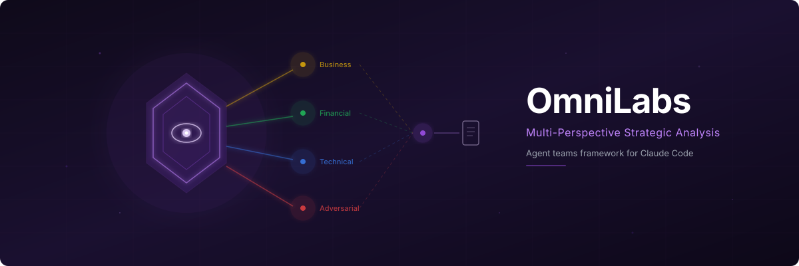
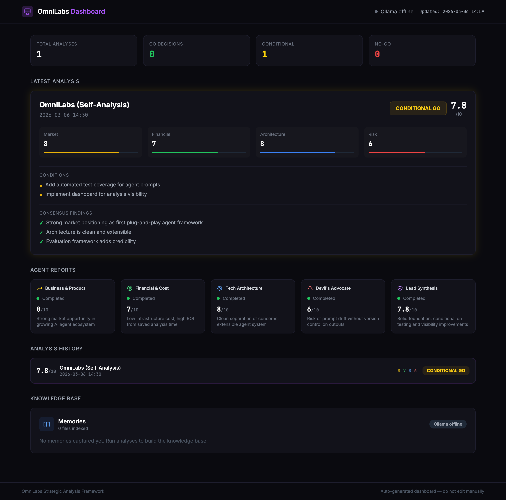

<p align="center">
  
</p>

<p align="center">
  <a href="LICENSE"></a>
  <a href="https://claude.com/claude-code"></a>
  <a href="#built-in-agents"></a>
  <a href="#create-your-own-agent"></a>
  <a href="#"></a>
  <a href="https://github.com/sponsors/Viniciuscarvalho"></a>
</p>

<p align="center">
  <strong>Extensible MCP server for multi-perspective project analysis.</strong><br>
  Add an agent in one YAML file. No Python required.<br>
  <sub>Inspired by <a href="https://github.com/EricTechPro/awesome-claude-code-agents">Eric Tech's</a> work on Claude Code sub-agent structures.</sub>
</p>

---

## What It Does

OmniLabs is an **MCP server** that turns Claude Code into a team of specialized analysts. It ships with 4 core agents and supports 13+ marketing agents, with a **3-gate control flow** (Discover → Plan → Execute) that previews token cost before anything runs.

- **Token-aware** — preview prompt cost before execution, nothing runs by default
- **YAML-driven** — each agent is a single `.yaml` file, no code required
- **Extensible** — drop a YAML in `~/.omnilabs/agents/` and it's instantly available
- **Presets** — named groups (core, health-check, marketing, gtm) for common scenarios
- **Code-first** — agents read the actual codebase, not just documentation
- **Evidence-based** — every finding must be traceable to code or data
- **Live dashboard** — real-time progress at `http://localhost:3141` with cost tier badges
- **Language-agnostic** — works with any tech stack, any language, any framework

---

## How It Works

```
         ┌──────────────────────────────────────────────────────────────┐
         │                    CLAUDE CODE + MCP                         │
         │                                                              │
         │  Gate 1: DISCOVER                                            │
         │  list_agents() / recommend_agents() / list_presets()         │
         │                         │                                    │
         │  Gate 2: PLAN                                                │
         │  plan_analysis() → preview token cost                        │
         │                         │                                    │
         │  Gate 3: EXECUTE                                             │
         │  start_analysis() → run_agent() → save_agent_result()       │
         │                         │                                    │
         │              🟣 Synthesized Report                           │
         │              GO / NO-GO / CONDITIONAL GO                     │
         │                                                              │
         │              📡 Live dashboard at :3141                      │
         └──────────────────────────────────────────────────────────────┘
```

OmniLabs runs as an **MCP server** inside Claude Code. The 3-gate flow ensures you choose which agents run and preview token cost before anything executes. The live dashboard updates in real-time as agents complete.

---

## Quick Start

### 1. Install

```bash
pip install -e .
```

Or install directly from the repo:

```bash
pip install git+https://github.com/Viniciuscarvalho/OmniLabs.git
```

### 2. Configure Claude Code

Add OmniLabs to your Claude Code MCP settings (`~/.claude/settings.json`):

```json
{
  "mcpServers": {
    "omnilabs": {
      "command": "omnilabs-mcp"
    }
  }
}
```

### 3. Run an analysis

Open Claude Code in any project and paste:

```
Analyze this project with OmniLabs using the core preset
```

Or let OmniLabs recommend agents for your task:

```
Use OmniLabs to recommend agents for improving our SEO
```

Claude Code will:

1. **Discover** — browse agents with `list_agents` or get recommendations with `recommend_agents`
2. **Plan** — preview token cost with `plan_analysis` before committing
3. **Execute** — run each agent one at a time via `run_agent`, save results
4. **Synthesize** — produce unified report with GO / NO-GO / CONDITIONAL GO
5. Dashboard updates live at `http://localhost:3141`

---

## Built-in Agents (Core)

|     | Agent         | Focus                                                    | Key Outputs                                                                            |
| --- | ------------- | -------------------------------------------------------- | -------------------------------------------------------------------------------------- |
| 📊  | `business`    | Product-market fit, competitive landscape, GTM readiness | Viability score, TAM/SAM/SOM, moat assessment, GTM strategy                            |
| 💰  | `financial`   | Infrastructure costs, TCO modeling, build-vs-buy         | Cost projections at 4 scales, unit economics, ROI analysis                             |
| 🔧  | `technical`   | Architecture quality across 6 dimensions                 | Scalability, reliability, security, maintainability, observability, operability scores |
| 🎯  | `adversarial` | Stress-testing assumptions, blind spots                  | Risk heat map, failure scenarios, pre-mortem analysis                                  |

Core agents are in `src/omnilabs_mcp/agents/builtin/*.yaml` and auto-discovered at startup.

## Marketing Agents (13)

Convert from markdown source and install to `~/.omnilabs/agents/`:

```bash
python scripts/convert_agents.py ~/marketing-agent ~/.omnilabs/agents/
```

| Icon | Agent                         | Focus                                    |
| ---- | ----------------------------- | ---------------------------------------- |
| 🔍   | `seo-strategist`              | Keyword research, technical SEO, on-page |
| 📝   | `content-strategist`          | Editorial calendars, content audits      |
| ✍️   | `copywriter`                  | Landing pages, ads, emails, product copy |
| 📱   | `social-media-manager`        | Social strategy, content calendars       |
| 🤝   | `community-manager`           | Community building, engagement           |
| 🎯   | `product-marketing-manager`   | Positioning, messaging, launches         |
| 🚀   | `gtm-strategist`              | Go-to-market planning, channel strategy  |
| 📧   | `email-marketing-specialist`  | Automation flows, segmentation           |
| 🔄   | `lifecycle-marketing-manager` | Onboarding, retention, churn prevention  |
| 📊   | `marketing-analyst`           | Attribution, funnel analysis, ROI        |
| 📈   | `cro-specialist`              | A/B testing, funnel optimization         |
| 📢   | `pr-strategist`               | Media outreach, press releases           |
| 💬   | `communications-manager`      | Internal comms, brand voice              |

## Presets

| Preset          | Agents                                                          | Use Case                  |
| --------------- | --------------------------------------------------------------- | ------------------------- |
| `core`          | business, financial, technical, adversarial                     | Full strategic analysis   |
| `health-check`  | technical, adversarial                                          | Quick architecture review |
| `due-diligence` | business, financial, adversarial                                | Investment analysis       |
| `marketing`     | All agents with "marketing" tag                                 | Marketing strategy        |
| `gtm`           | business, gtm-strategist, product-marketing-manager, copywriter | Go-to-market readiness    |

---

## MCP Tools & Resources

### Tools — Discovery (Gate 1)

| Tool                     | Description                                    |
| ------------------------ | ---------------------------------------------- |
| `list_agents(tag?)`      | Browse agents with focus, tags, and token cost |
| `recommend_agents(task)` | Suggest agents based on task description       |
| `list_presets()`         | Show named agent presets with token totals     |

### Tools — Planning (Gate 2)

| Tool                                         | Description                                |
| -------------------------------------------- | ------------------------------------------ |
| `plan_analysis(repo_path, agents?, preset?)` | Preview token cost before running anything |

### Tools — Execution (Gate 3)

| Tool                                          | Description                                   |
| --------------------------------------------- | --------------------------------------------- |
| `start_analysis(repo_path, agents?, preset?)` | Start session with specific agents (required) |
| `run_agent(agent)`                            | Run ONE agent, returns its prompt             |
| `save_agent_result(agent, analysis)`          | Save output, shows next in queue              |
| `mark_agent_error(agent, error)`              | Mark failed, skip to next                     |

### Tools — Query

| Tool                      | Description                                   |
| ------------------------- | --------------------------------------------- |
| `get_session_status()`    | Check status of all agents in current session |
| `get_agent_output(agent)` | Get full output from a completed agent        |
| `list_sessions()`         | List all analysis sessions                    |

### Prompts

| Prompt                                   | Description                              |
| ---------------------------------------- | ---------------------------------------- |
| `analyze(repo_path, agents)`             | Run specific agents (comma-separated)    |
| `analyze_with_preset(repo_path, preset)` | Run a preset group of agents             |
| `smart_analyze(repo_path, goal)`         | Let OmniLabs recommend agents for a goal |

### Resources

| URI                          | Description                                   |
| ---------------------------- | --------------------------------------------- |
| `omnilabs://agents/catalog`  | Full agent catalog (auto-generated from YAML) |
| `omnilabs://session/current` | Current session state                         |

---

## Create Your Own Agent

Adding an agent is a **single YAML file**. No Python, no registry updates, no code changes.

### Option 1: Personal agent (local only)

Drop a `.yaml` file in `~/.omnilabs/agents/`:

```yaml
id: security
name: Security Audit
icon: "🛡️"
focus: Vulnerability assessment, auth review, OWASP Top 10
tags: [engineering, compliance]
key_outputs:
  - Vulnerability inventory by severity
  - Auth & authorization audit
  - OWASP Top 10 coverage map

system_prompt: |
  You are a senior application security engineer...

  Read the entire codebase. Find vulnerabilities a real attacker would exploit.

  **Authentication & Authorization**
  - How does the app authenticate users?
  - Are there routes accessible without authorization?

  **Verdict**
  - Security posture score (1-10).
  - Top 5 vulnerabilities to fix immediately.

  CRITICAL: Every finding must cite specific files and code as evidence.
```

Restart Claude Code and it's available immediately via `list_agents`.

### Option 2: Contribute to the project (PR)

Save your YAML to `src/omnilabs_mcp/agents/builtin/` and open a PR. See [CONTRIBUTING.md](CONTRIBUTING.md) for the full guide.

### Required fields

| Field           | Rules                                                                            |
| --------------- | -------------------------------------------------------------------------------- |
| `id`            | Lowercase, alphanumeric with `_` or `-`. Must be unique.                         |
| `name`          | Human-readable, title case.                                                      |
| `icon`          | Single emoji.                                                                    |
| `focus`         | One sentence — shown in dashboard and catalog.                                   |
| `tags`          | At least one. Existing: `core`, `engineering`, `strategy`, `risk`, `compliance`. |
| `key_outputs`   | 2-4 concrete deliverables.                                                       |
| `system_prompt` | Full expert prompt. **Must be >100 chars.**                                      |

### Override built-in agents

Create a YAML with the **same `id`** in `~/.omnilabs/agents/`. User agents override built-in ones.

### Template

See [`examples/TEMPLATE.yaml`](examples/TEMPLATE.yaml) for a starter template, and [`examples/security.yaml`](examples/security.yaml) for a complete community agent example.

---

## Dashboard

The dashboard runs automatically at `http://localhost:3141` when the MCP server starts. It updates in real-time as agents run.

<p align="center">
  
</p>

### What it shows

- **Session info** — current repo being analyzed
- **Agent cards** — status (idle → running → completed/failed), duration, focus area, tags, cost tier badges
- **Live updates** — polls every 1.5s, no manual refresh needed
- **Agent count** — total registered agents (built-in + custom)

State is stored in `~/.omnilabs/state.json` and agent metadata in `~/.omnilabs/agents.json`.

---

## Running Agents

Use presets for common scenarios:

```
Analyze ~/my-project with OmniLabs using the health-check preset
```

Or pick specific agents:

```
Analyze ~/my-project with OmniLabs agents: technical, adversarial
```

Or let OmniLabs recommend based on your goal:

```
Use OmniLabs smart_analyze on ~/my-project with goal: improve marketing funnel
```

---

## Agent Discovery

Agents are auto-discovered from two directories, in order (later overrides earlier):

```
1. src/omnilabs_mcp/agents/builtin/*.yaml   ← ships with OmniLabs
2. ~/.omnilabs/agents/*.yaml                 ← your custom/override agents
```

This means you can:

- **Add** new agents by dropping YAML files in `~/.omnilabs/agents/`
- **Override** built-in agents by using the same `id`
- **Share** agents by contributing to `builtin/` via PR

---

## Project Structure

```
OmniLabs/
├── src/omnilabs_mcp/
│   ├── server.py                     # MCP server — tools, resources, prompts
│   ├── agents/
│   │   ├── spec.py                   # AgentSpec dataclass (the contract)
│   │   ├── registry.py               # Auto-discovery from YAML files
│   │   └── builtin/                  # Built-in agent definitions
│   │       ├── business.yaml         # 📊 Business & Product
│   │       ├── financial.yaml        # 💰 Financial & Cost
│   │       ├── technical.yaml        # 🔧 Technical Architecture
│   │       └── adversarial.yaml      # 🎯 Devil's Advocate
│   ├── core/
│   │   ├── models.py                 # Session & AgentResult models
│   │   └── store.py                  # In-memory session store + JSON sync
│   └── dashboard/
│       └── app.py                    # Live dashboard at :3141
├── scripts/
│   └── convert_agents.py             # Convert .md agents to .yaml format
├── examples/
│   ├── TEMPLATE.yaml                 # Starter template for new agents
│   └── security.yaml                 # Example community agent
├── tests/
│   └── test_core.py                  # Core tests
├── .claude/
│   ├── agents/                       # Claude Code subagent definitions
│   │   ├── business-product.md
│   │   ├── financial-cost.md
│   │   ├── technical-architecture.md
│   │   ├── devils-advocate.md
│   │   └── lead-synthesis.md
│   ├── skills/                       # Claude Code skills
│   ├── hooks/                        # Session & tool hooks
│   └── CLAUDE.md
├── evaluation/                       # Agent eval framework
├── docs/                             # Architecture & guides
├── CONTRIBUTING.md                   # How to add an agent (single-file PR)
├── pyproject.toml
├── install.sh
└── LICENSE
```

---

## Evaluation Framework

OmniLabs ships with evals to validate agent output quality. See [docs/evaluation-guide.md](docs/evaluation-guide.md) for the full guide.

```bash
# Run all evaluations
bash evaluation/harness/run-all.sh

# Run for a single agent
bash evaluation/harness/run-all.sh --agent business-product

# Run grader test suite
bash evaluation/tests/test-graders.sh
```

Two layers:

- **Code-based graders** — deterministic bash scripts that validate structure (CI-ready)
- **Model-based rubrics** — LLM-as-Judge scoring across 5 dimensions per agent

---

## Continuous Learning (Optional)

OmniLabs can learn from analysis sessions via a local knowledge base. Requires [Ollama](https://ollama.com) with `nomic-embed-text`. The system degrades gracefully if Ollama is unavailable.

See [docs/continuous-learning.md](docs/continuous-learning.md) for the full guide.

---

## Requirements

- Python 3.11+
- [Claude Code](https://claude.com/claude-code) CLI
- Dependencies: `fastmcp>=2.0.0`, `pydantic>=2.0.0`

---

## Contributing

Adding a new agent is a **single-file PR** — just a YAML file in `src/omnilabs_mcp/agents/builtin/`. No Python changes needed.

See [CONTRIBUTING.md](CONTRIBUTING.md) for the step-by-step guide, prompt guidelines, and agent ideas we'd love to see.

---

## Sponsors

OmniLabs is free and open source. If it saves you time or helps you make better decisions, consider sponsoring to support continued development.

<p align="center">
  <a href="https://github.com/sponsors/Viniciuscarvalho">
    
  </a>
</p>

---

<p align="center">
  <sub>MIT License — see <a href="LICENSE">LICENSE</a></sub>
</p>
